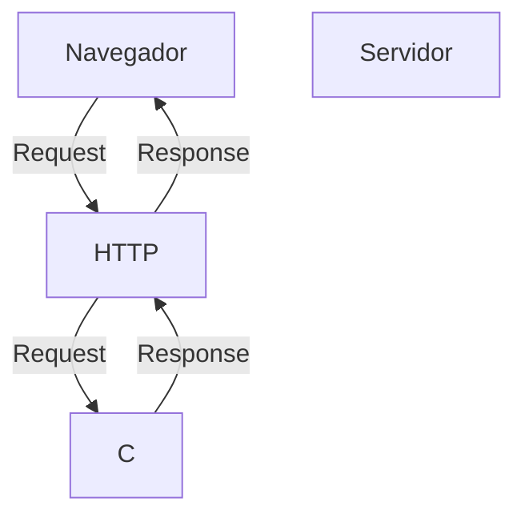
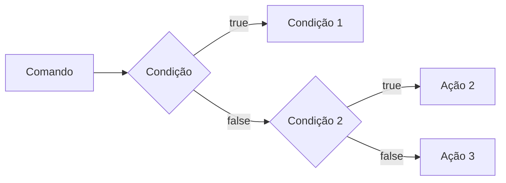
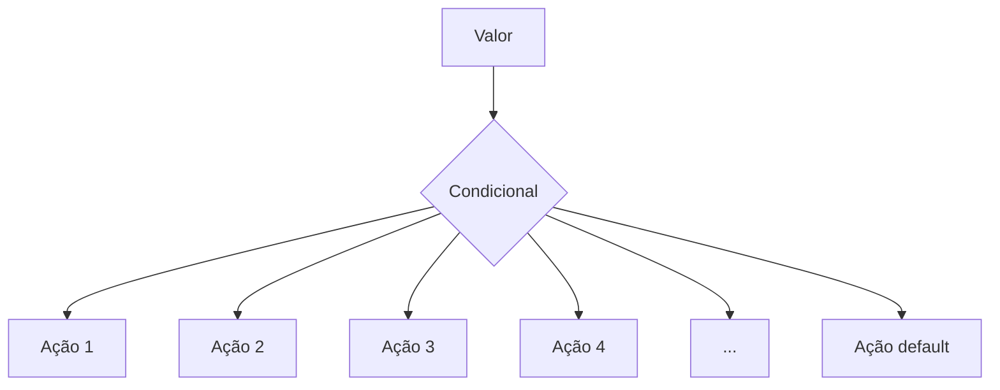
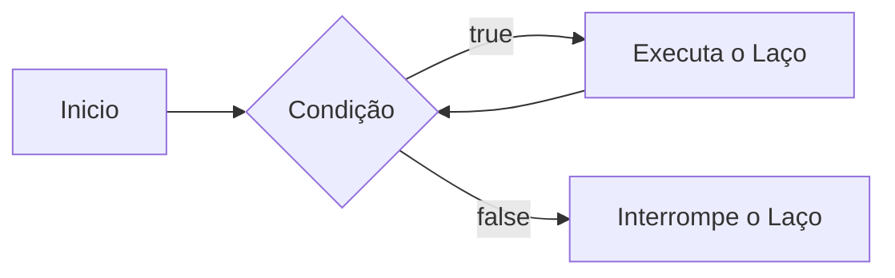
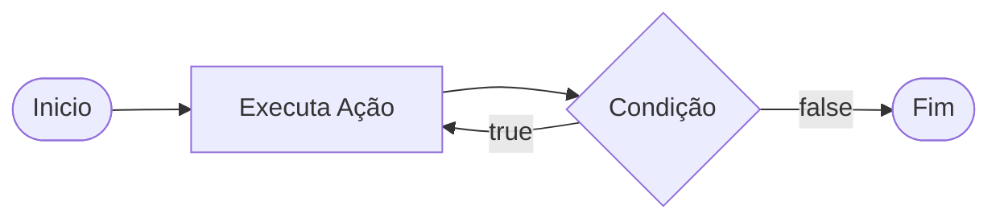
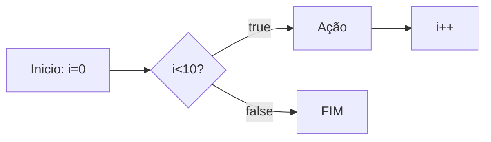

# Curso BackEnd - 1 Semestre - 105h

Prof. Diogo Barbosa

escola SENAI Americana

2 Semestre de 2026

## Objetivo do curso

- Desenvolver Aplicações Web server Side, utilizando a linguagem PHP;
- Aplicar sintaxe nativa php Vanilla;
- Manipulação HTTP;
- Percistencia de dados (Armazenamento em BD);
- Segurança contra SQL Injection/csrf;
- Refatoração em POO (programação orientada objeto);
- Arquitetura MVC;
- Utilização do FrameWork Laravel

## Cronograma do semestre

Carga horária: 105h

Duração: 20 semanas

### Semana 1: Introdução ao BackEnd e configuração do ambiente PHP

#### O que é BackEnd?
O BackEnd é a parte de um site ou aplicativo que o usuario não ve, mas que faz tudo funcionar por trás das telas.

As principais linguagens utilizandas no desenvolvimento Back-End são PHP, JavaScript/typeScript, Python, Java, Kotlin, Go (Golang), C# e Rust.

- Guarda e organiza informações em um banco de dados;
- confere se o login e a senha estão corretos;
- Calcula valores, como o frete ou o total de uma compra;
- Garante que os dados de um usuario não apareçam para o outro;
- faz o sistema suportar muitas pessoas usando ao mesmo empo, sem travar

O Back-End é o "Cérebro"oculto de um site ou aplicativo.ele roda em um servidor e cuida de tudo o que o usuario não ve na tela.

## As 3 partes básicas de todo BackEnd:
1. **Servidor**
O "computador" que fica ligado esperando pedidos  (requisições);
2. **Banco de dados:**  onde as informações ficam guardadas (usuários, produtos, mensagens, etc.);
3. **Lógica de negócio:**  as regras do sistema (ex: "não deixa comprar se não tiver estoque").

**O Mercado de Trabalho em Back-end**

O desenvolvimento Back-end é uma das áreas mais cruciais da Tecnologia da Informação. 

- Com a transformação digital acelerada, empresas de todos os portes e setores dependem de infraestruturas sólidas e seguras. 

- Setores de Atuação: Bancos, hospitais, e-commerces, logística, indústrias, startups e órgãos públicos utilizam Back-end para suportar suas operações críticas.

- Fatores de Crescimento: O avanço da computação em nuvem, aplicativos móveis, Big Data e IA impulsiona continuamente a busca por profissionais da área.

- Modelos de Trabalho: Alta flexibilidade com vagas presenciais, híbridas e remotas (inclusive com oportunidades internacionais).


#### Ciclo de vida da requisição HTTP

##### Oque é HTTP?

HTTP, Hypertext Tranfer Protocolo, é um protocolo de comunicação utilizado para tranferencia de informações na  www(Word Wide Web) e em outros sistemas de redes

O HTTP é a base para que o cliente e um servidor web troquem informações. ele permite a requisição e a resposta de recursos, como imagens, arquivos e as proprias paginas web, por meio de mensagens (protocolos);

##### Como Funciona o HTTP?

1. O cliente estabele contato com o servidor, encamihando uma requisição HTTP;
2. Nessa Requisição o cliente especifica o método pretendido (read-GET, create-POST, update-PUT/PATCH, delete-DELETE)
3.  O servidor processa ou responde com uma mensagem HTTP, com os recursos solicitados .´


#### Como funciona na pratica o BackEnd

- **Ação do usuario:** Envia uma solicitação pera UI (Interface do Usuario). Exemplo de UI: Tela do celular, Navegador da Internet, Alexa...
- **Envio da requisição:** a UI transforma ação do usuario em requisição HTTP
- **O processamento BackEnd:** o codigo backEnd recebe o pedido, valida os dados e decide o que fazer (ex: consulta uma informação no banco de dados)
- **Resposta:** O servidor devolve o resultado para a UI (Ex: um login autorizado, uma compra confirmada, )

#### Tipos de Requisição HTTP
 os tipos de requisição HTTP indicam a ação que o usuario deseja executar no servidor. as principais ações são:

 - **GET:** pede dados de um lugar especifico. "Não faz alterações no servidor"
 - **POST:** Envia dados novos para *criar* algo ou processar informações.
 - **PUT/PATCH:** Modificar dados já existentes. *PUT* Atualização geral dos dados. *PATCH* Atualização parcial dos dados.
 - **DELETE:** Apaga um dado do servidor.

#### Iniciando o PHP


##### O que é PHP?

**PHP** (Hypertext PreProcessor) é uma linguagem de programação interpretada e open source, focada no desenvolvimento de sistemas para web, pode ser usada junto com HTML para criação de paginas web dinamicas

##### Instalando o PHP
- fazer o Dowload do PHP (php.net);
- ZIP - non theread safe 8.5
- Descompactar o arquivo do php na pasta C:\src\php (para Descompacatar, usar o 7Zip = Melhor) => nunca salvar um arquivo na raiz do sistema(c:)
- Modificar o arquivo php.ini-development para => php.ini (Criar as configurações do PHP na Maquina) - adicional ou remover funcionalidade do PHP
- Adicionar a pasta do PHP(c:\src\php) as variaveis de ambiente do sistema (PATCH)
- verificar a instalação rodando o comando php --version

##### Contextualizando o PHP
O PHP de fato é uma das linguagens de programação mais populares da atualização. Ela permite que voce crie aplicações web robustas, de uma maneira muito simplificada e direto ao ponto.
sem contar que a linguagem traz diversos recursos que faciitam e aceleram o processo de desenvolvimento de sites e sistemas para a web. E além do mais, ela ainda tem um otimo ecossistema, uma exelente comunidade e um grande mercado de trbalho.

##### Criando minha primeira aplicação em PHP
Criando um Hello, Word!

##### Criando o perfil de PHPVanilla

-> Profile -> New Profile
-> Extensions:
- PHP InterPhense ( a do elefantinho): AutoCompletar (Snipets)
- PHP Debug (Xdebug): Acha erros
- PHP CS FIXER : Formatação padrão do codigo(identação)
- PHP Server: Sobre um servidor local para acompanhamento em tempo real.


##### Estudo de Variaveis e constantes em PHP

Declarar Váriaveis é alocar um espaço na memoria que permite a inclusão e manipulação de dados.

**Variáveis**

- devem ser declaradas  usando "$" antes do none da variável
- podem ser string, numérica (integer e flost), booleanas e nulas. não permite declaração de Undefined
- são não tipadas (não precisa declarar o tipo na criação),  a tipagem é atribuida ao adicionar o valor
- usar o "declare(strict_types=1);" n aprimeira linha do arquivo ; => blindar o sistema contra conflitos de tipos de variaveis

**Constantes**

- não podem ser modificadas ou redeclaradas após a criação
- pode ser criada usando "const" ou "define"
- não permitem interpolção


### Semana 2 - Operadores em PHP ( aritméticos, Relacionais e Lógicos)

##### Estudo de Operadores

**Aritméticos**: são usados para realizar cáuculos

| Operador | Nome | Exemplo | Resultado |
| - | - | - | - |
| + | Adição | 10 + 5 | 15 |
| - | Subtração | 10 - 5 | 5 |
| * | Mutiplicação | 10 * 5 | 50 |
| / | Divisão | 10 / 5 | 2 |
| % | Módulo (Resto) | 10 % 3 | 1 (10 div 3 da 3, sobre 1) |
| ** | Expoente | 2 ** 3 | 8(2 elevado a 3) |

Obs: O Operador % é o melhor amigo de um programação, permite ordenar listas e organizar fila e pilhas.

**Relacionais** : Permitem uma comparação entre dois ou mais valores,  o resultado de uma operação relacional é sempre uma booleana (true, false)

| Nomes | Operador | Exemplo | Resultado |
| - | - | - | - |
| Iguais | == | "10"==10 | true |
| Igualdade estrita | === | "10"===10 | false |
| Diferente | != | "10"!=10 | false|
| Diferença estrita | !== | "10"!==10 | true |
| Maior que | > | 18 > 18 | false |
| Menor que | < | 10 < 20 | true |
| Maior ou igual | >= | 18 >= 18 | true|
| Menor ou igual | <= | 10 <= 5 | false |

**Lógicos**: Permite a combinação entre sentenças.

- Operador AND (E) => && : para o resultado se verdadeiro, TODAS as combinações precisam ser verdadeiras
  - true && true => true
  - true && false => false
- Operador OR (OU) => || : para o resultado sera verdadeiro, basta APENAS UMA condição ser verdadeira
  - false || true => true
  - false || false => false

- Operador NOT (não) => ! : Inverte a lógica da sentença
  - !true => false
  - !false => true

  ### Semana 3 - Estrutura de controle de Dados (Condicionais e Repetição)

**Conteúdo**: Estrutura `if`, `else`, `elseif`, Operadores Ternários, `match` => 
 substituto do `swicth/case`, loops `for`, `while`, `do-while` e `foreach`

 #### Estrutura de Controle de dados ajudam no processo de automatização em programas e sistemas

 ##### Condicionais (IF, ELSE, ELSEIF)

 - **Forma de Uso**

 - Uso do `if` apenas:
 Exemplo: Aplicar um desconto de 10% em compras acima de 100 Reais

 ```mermaid

 graph LR
     A[Comando] --> B[Condição] --> C[Tomada de Decisão]

 ````

 ```php
 if ($valorCompra > 100) {
  $valorCompra = $valorCompra * 0.1
 }
 ```

 - Uso do `if` seguido do `else`
 Exemplo: Aplicar um desconto de 10% para compras acima de 100 reais e 5% para as demais compras

 ```mermaid

 graph LR

     A[Comando] --> B{Condição}
     B --> |true| C[Ação 1]
     B --> |false| D[Ação 2]

 ```

```php

if($valorCompra > 100) {
  $valorFinal = $valorCompra*0.1;
} else{
  $valorFinal = $valorCompra*0.05;
}

```

- Uso do `elseif` (Encadeado)
Exemplo: Compras acima de 200 reais tem 15% de desconto, acima de 100 reais tem 10% de desconto e outras 5% de desconto



```php

if($valorCompra > 200){
  $valorFinal = $valorCompra*0.85;
} elseif($valorCompra >100) {
  $valorFinal - $valorCompra*0.9;
} else {
  $valorFinal = $valorCompra*0.95;
}

```

*OBS*: Sempre Usar `elseif` para situações que precisam de mais de uma condição, ou seja, fazer encadeamento das condições.

*OBS* Uso **errado** do `if` que é não fazer o encadeamento de condicionais

Exemplo:

```php
if($valorCompra > 200) {
    $valorFinal = $valorCompra*0.85;
}
if($valorCompra > 100) {
    $valorFinal = $valorCompra*0.90;
}
if($valorCompra < 100) {
  $valorFinal = $valorCompra*0.95;
}

```

##### Operadores Ternários

um atalho para a estrutura condicional `if/else`, normalmente escrito em uma unica linha de código

` condição ? verdadeira : falso `

perfeito para decições curtas de uma linha de comando
Exemplo: Verificar se a pessoa é maior de idade (18)

```php

$idade = 20;
//O formato é : (condição) ? verdadeiro : falso;

$status = ($idade >= 18) ? "Maior de idade" : "Menor de idade";
$status2 = ($idade<18) ? "Criança" : ($idade<60) ? "adulto" : "idoso";
```

##### Expressão Condicional `match` (php 8)

No mercado de PHP atual, não se usa mais uma dezena de `if/elseif` para checar valores fixos, e o antigo `switch/case` caiu em desuso. Usamos o `macth`. Ele compara um valor e retorna diretamente o resultado




```php

$diaSemana = date("Week"); // Pega o dia da semana em formato numérico

//Tranforma dia da semana em formato texto (Domingo, Segunda,...)

$nomeDiaSemana = match($diaSemana){
  "0" => "Domingo",
  "1" => "Segunda",
  "2" => "Terça",
  "3" => "Quarta",
  "4" => "Quinta",
  "5" => "Sexta",
  "6" => "Sabado",
  "default" => "Dia Invalido"
};

```

##### Laços de Repetição

Um laço de repetição faz com que, um bloco de códigos rode várias vezes, até que uma condição mande parar.

- O Laço `while` (enquanto)

Ele verifica se a condição é vrdadeira ANTES de entrar no laço. Ideal quando voce não sabe quantas vezes vai rodar o laço.



Exemplo: Jogo de adivinhação de um número Secreto

```php

$numeroSecreto = 7;

$tentativas = 0;

while($tentativa != $numeroSecreto){
   echo "Tente Novamente"
  //vou pegar um número aleatório entre 1 e 10
  $tentativa = rand(1,10);
}

echo "Acertou !!! o número secreto é $numeroSecreto";

```

- O Laço `do-while` (Faça-enquanto)
A diferença é que ele executa o bloco pelo menos uma vez, mesmo que a condição seja falsa desde o inicio, pois ele só pergunta no final


Exemplo: Jogo de adivinhação

```php

$numeroSecreto = rand(1,10);

do {
    $tentativa = rand(1,10); Simular um palpite aleatório
    
    if($tentativa == $numeroSecreto){
      echo "parabéns, Acertou!!!!!"
    }
} while ($tentativa != $numeroSecreto);

```

OBS: Uso ideal do `do-while`, menus de sistema ou sistemas de solicitações de dados, sistemas interativos;


##### O Freio de Emergência: `break` e `continue`

As vezes precisamoso interferir no laço enquanto ele está rodando 

- `break`=> **Para Tudo!** Quebra o laço interiro e avai embora
- `continue` => **Pula a rodada!** Ele ignora o código daquela rodada especifica e pula logo par a próxima repetição.

Exemplo de Aplicação do Código: Sistema de Controle do Elevador

```php 

for($andar = 1 ; $andar<=10; $andar++){
    if($andar ==4){
        echo "Andar $andar está em obras. Passando direto!";
        continue;
    }

    echo "Elevador parou no andar $andar"
}

```
---

##### Laço de Repetição `for`

Use o `for` quando você sabe quantas  vezes precisa repetir uma ação ou quando preicisa controlar um contador. Ele possui 3 partes:

- Inicialização;
- Condição;
- Incremento;

for(inicialização; condição; incremento){
  Ação
}



Exemplo de Aplicação: Exibir todos os meses do ano

```php
for($mes=1;$mes<12;$mes++){
  ecgo "Mes $mes";
}
```

Nesse Exemplo `$mes` começa em 1, o laço continua enquanto `$mes` for menos ou igual a 12 e;, ao final de cada repetição, `$mes` aumenta o contador em 1.

##### Laço de Repetição `forech`

use o `foreach` quando precisar precorrer cada item de um **array**. Ele acessa os elementos diretamente, sem que você precisa controlar o contador.

Exemplo: Imprimir todos os itens de um vetor

```php
$frutas = ["Maça", "Banana", "Uva", "Laranja"];

foreach($frutas as $fruta){
  echo "Fruta: $fruta";
}

```


outro exemplo: Acessar a chave e o valor de cada item:

```php
$preços = [
  "Caderno" => 25.00,
  "Caneta" => 5.50,
  "mochila" => 99.00
]; //Vetor não ordenado do tipo chave(key) => valor(value) ===> coleção/dicionario

//percorrer o vetor usando o laço foreach
foreach($preços as $produto => $preço){
  echo "$produto: R$" . number_format($preço,2);
}
//acessa a chave e o valor de cada item do vetor
```

---
---
#### Desafio : Simulador de cobrança (FINANSENAI)

#### Desafio Final

---
---

### Semana 4 - Modularização com Funções

#### Principio do DRY (Don´t Repeat Yourself)

Se uma lógica foi escrita duas ou mais vezes dentro de um código, essa lógica deve virar uma função.

#### Função nativas do PHP

O PHP tem milhares de funções prontas, essa função já criada é chamada de função nativa.

- **O que é uma Função?**

Uma função é como uma máquina: você coloca a matéria-prima (Parâmetro), ela processa e devolve um produto final (Retorno)

Exemplo de função nativa
```php
$texto = "senai americana";

//usar uma função nativa para substituição de parte do texto ==> str_replace
$textoNovo = str_replace("americana", "são paulo", $testo);
//"senai são paulo"

//usar uma função nativa para substituição das letras minúsculas por letras maiúsculas => strtoupper 
echo strtoupper($textoNovo); //SENAI SÃO PAULO
```

##### Principais Funções Nativas (Mais Utilizadas)

As funções abaixo já fazem parte do PHP e podem ser chamadas diretamente no código. Observe os parâmetros que cada uma recebe e o tipo de informação que ela retorna.

```php
| Função | Categoria | O que faz | Como usar |
|---|---|---|---|
| `strlen()` | Strings | Retorna a quantidade de caracteres de um texto. | `$tamanho = strlen($texto);` |
| `strtoupper()` | Strings | Converte o texto para letras maiúsculas. | `$resultado = strtoupper($texto);` |
| `strtolower()` | Strings | Converte o texto para letras minúsculas. | `$resultado = strtolower($texto);` |
| `ucfirst()` | Strings | Converte a primeira letra do texto para maiúscula. | `$resultado = ucfirst($texto);` |
| `trim()` | Strings | Remove espaços e quebras de linha no início e no fim do texto. | `$limpo = trim($texto);` |
| `str_replace()` | Strings | Substitui uma parte do texto por outra. | `$novo = str_replace("-", "", $cpf);` |
| `substr()` | Strings | Extrai uma parte do texto a partir de uma posição. | `$inicio = substr($texto, 0, 3);` |
| `explode()` | Strings | Divide um texto e cria um array usando um separador. | `$palavras = explode(" ", $nome);` |
| `implode()` | Arrays | Junta os itens de um array em um único texto. | `$lista = implode(", ", $nomes);` |
| `count()` | Arrays | Conta a quantidade de itens de um array. | `$total = count($produtos);` |
| `in_array()` | Arrays | Verifica se um valor existe dentro de um array. | `$existe = in_array("SP", $estados, true);` |
| `array_push()` | Arrays | Adiciona um ou mais itens ao final de um array. | `array_push($nomes, "Ana");` |
| `array_pop()` | Arrays | Remove e retorna o último item de um array. | `$ultimo = array_pop($nomes);` |
| `sort()` | Arrays | Ordena um array em ordem crescente e reorganiza suas chaves. | `sort($notas);` |
| `array_keys()` | Arrays | Retorna um array contendo as chaves de outro array. | `$chaves = array_keys($produtos);` |
| `number_format()` | Números | Formata um número com casas decimais e separadores definidos. | `$preco = number_format($valor, 2, ',', '.');` |
| `round()` | Números | Arredonda um número para a quantidade de casas informada. | `$media = round($nota, 2);` |
| `max()` | Números | Retorna o maior valor de uma lista ou array. | `$maior = max($notas);` |
| `min()` | Números | Retorna o menor valor de uma lista ou array. | `$menor = min($notas);` |
| `is_numeric()` | Validação | Verifica se o valor é um número ou uma string numérica. | `if (is_numeric($entrada)) { ... }` |
| `isset()` | Validação | Verifica se uma variável existe e não possui valor `null`. | `if (isset($usuario)) { ... }` |
| `empty()` | Validação | Verifica se uma variável está vazia. | `if (empty($pedido)) { ... }` |
| `date()` | Data e hora | Formata uma data ou hora conforme uma máscara. | `$hoje = date('d/m/Y');` |
| `file_exists()` | Arquivos | Verifica se um arquivo ou diretório existe. | `if (file_exists('dados.txt')) { ... }` |
| `file_get_contents()` | Arquivos | Lê todo o conteúdo de um arquivo ou endereço. | `$conteudo = file_get_contents('dados.txt');` |
| `file_put_contents()` | Arquivos | Grava conteúdo em um arquivo, criando-o se necessário. | `file_put_contents('log.txt', $mensagem);` |

**Atenção:** algumas funções modificam o array original, como `sort()`, `array_push()` e `array_pop()`. Já outras retornam um novo valor, como `count()`, `explode()` e `str_replace()`. Em caso de dúvida, consulte a documentação oficial do PHP e verifique o retorno da função.
```
##### Documentação PHP

[Acesse a documentação oficial do PHP em português](https://www.php.net/manual/pt_BR/)

Consulte também a [referência de funções do PHP em ](https://www.php.net/manual/pt_BR/funcref.php) para pesquisar a sintaxe, osparâmetros e os valores para cada função.


#### Funções Customizadas (Criando suas próprias máquinas)

Quando o PHP não tem a função que queremos, nós a criamos!

**A Regra de Ouro**: Uma função deve focar em `return` (retornar um valor), e não imprimir (`echo`).


Veja a diferença nesse exemplo:

```php
function calcularTotal($preco, $quantidade){
    // a função calcula e retorna o resultado, mas não imprimi nada
    return $preco * $quantidade;
}

$tootal = calcularTotal(25.00, 3);

//imprimir é feito fora da função
echo "Total de compra: R$ " .round($total,2);
//Total da compra: R$75.00
```

A função  `calcualrTotal()`pode ser reutilizada em uma página, relatório ou teste. O `echo`aparece somente fora da função, no momento de apresentar o resultadi para o usuário.

##### Padrão de uso corporativo (PHP 8 Strict Types)

No mercado de trabalho, exigimos que a função avise exatamente o **TIPO** de dado que ela espera receber e o **TIPO** de dado que ela vai devolver.

Isso é chamado de **tipagem de funções**. Ao declarar os tipos, o codigo fica mais facil de entender e o PHP consegue identificar alguns erros antes que eles causem problemas maiores no sistema.

Os tipos mais usados:

* `int`: número inteiro, `10` ou `1024`;
* `float`: numero decimal ou ponto flutuante, `10.90`;
* `string`: Texto, como `"Maria"`;
* `bool`: valor lógico, `true` ou `false`;
* `void`: identifica que a função não devolve nenhum valor;

O tipo deve ser escrito antes do nome de cada parâmetro e o tipo da função deve ser escrito após os parênteses, precedido do ":", informando o que a função vai devolver

Exemplo de uso de função e parâmetros tipados:

```php
function apresentarProduto(string $nome, float $preço):
string{
  return "$nome custa R$ $preco";
}

$mensagem = apresentarProduto("Caderno",25.00);
echo $mensagem;
//Caderno custa R$ 25.90
```

>**Resumo**: os tipos dos parametros documentam as entradas da função, o tipo após `:` documenta a saida da função.

##### O Tipo Mágico : `VOID`

Se uma função faz um trabalho e **não retorna nada**, dizemos que o retorno dela é "vazio" (`void`).

Exemplo de função sem retorno:

```php
function registraLog(string $mensagem): void{
  //Apenas salve em um arquivo de texto, não devolver nenhuma variavel
  file_put_contents("erro.log", $mensagem);
}
```

#### Escopo e Referencia (O Segredo da Memória)

##### O que é Escopo? ( A Regra de Las Vegas)

*O que acontece dentro da função, fica dentro da função*. Uma variavel criada fora não existe la dentro, e uma criada lá dentro morre quando a função acaba.

**Escopo** é o local do programa onde a variavel pode ser armazenada/acessada. em PHP, uma variavel criada fora da função pertence ao **escopo global*, uma variavel criada dentro de uma função pertence ao **escopo local**.

Exemplo de escopo de variavel:

```php
$nomeSistema = "CRM SENAI"; //variavel global
function criarMensagem(string $nome): string{
  $mensagem = "Bem-Vindo!!!"; //escopo local
  return $menssagem . $nome;
}

echo $nomeSistema; //correto; esta mo escopo global
echo $mensagem; // errado: $mensagem só existe dentro da função, não é acessada fora
echo criarMensagem("Nome do Fulano"); //correto: A função devolve sua variavel local
//CSM SENAI
//Bem-Vindo!!! Nome do Fulano
```

* *Como Enviar Dados Para uma Função?*

A forma mais segura e organizada é enviar os dados por **parâmetros**. Assim, a função não precisa acessar diretamente variaveis globais;

```php
function saudar(string $nome):string{
  return "Olá, $nome!";
}


$nomeCliente = "João";
echo saudar($nomeCliente); // Olá, João!
```

Nesse Caso , `$nomeCliente` continua no escopo global, mas seu valor é enviado para o parâmetro local `$nome`. Afunção recebe uma informação, processa e retrona o resultado.

**Exemplo Incorreto:**

```php
$nome = "João"; //variável global

function saudar() :string{
    return "Olá, $nome"; // Errado: a função não reconhece a variável global 
}
```
A função `saudar()`não conhece a variável global `$nome`. Ocasionando um erro no sistema.

>**Resumo**: Variavel protegem os dados internos da função; parametros são o caminho recomendado para evitar erros e enviar informações, e `return` é usado para devolver um resultado ao codigo que chamou a função.


---

### Semana 5 - Arrays  e Manipulação avançada de dados

Um Array também conhecido como vetor é uma estrutura de dados usada para armazenar vários valores em uma única variavel.

**Tipos de Arrays em PHP:**
- Indexados(Núméricos): Usam Números inteiros como índices(chaves), que começam em zero por padrão;
- Associativos(Strings): Usam chaves(string) para identificar valores;
- Multidimensionais: contêm um ou mais arrays dentro de outros arrays.

**Exemplo de arrays :**

```php
//array idexado
$frutas = ["maça", "banana", "laranja"];

//array associativo
$capitais = [
  "SP" => "São Paulo",
  "MG" => "Belo Horrizonte",
  "RJ" => "Rio de Janeiro",
  "ES" => "Vitória"
];

//acessando dados
echo $fruta[0]; //"maça"
echo $capitais["SP"]; // São Paulo

```
> OBS: Em arrays associativos, nos trocamos os numeros do indice por nomes(chaves/keys). A setinha => significa "recebe"

**Arrays Multidimencionais (Banco de Dados na Memória)

É aqui que o "BackEnd" começa de verdade. o Array Multidimencional é o formato como os Bancos de Dados chegam como respostas as solicitações feitas pela API.

**Exemplo de Aplicação de Array Multidimencional**

```php 
$clientes = [
  ["id" => 1, "nome"=>"Ana", "email"=>"ana@gmail.com", "ativo"=>true]
  ["id" => 2, "nome"=>"Bruno", "email"=>"bruno@gmail.com", "ativo"=>false]
  ["id" => 3, "nome"=>"Carlos", "email"=>"carlos@gmail.com", "ativo"=>true]
];

//Como Acessar o email do Bruno
echo $cliente[1]["email"]; //bruno@gmail.com

```
 
 #### O Melhor Amigo dos Arrays: `O Foreach`

 O laço de repetição especial para arrays. O `foreach` percorre cada elemento de um array.

 **Exemplo de Aplicação**

 ```php
 foreach($clientes as $clienteAtual){
  echo $clienteAtual["nome"];
  echo $clienteAtual["email"];
 }
 //vai imprimir nome e email de todos os clientes do array.

 ```

 #### Transformação de Arrays (Arrow Function)

 São usadas em filtragem de e mapeamento de dados de um array

 - `array_filtro`
 Serve para buscar dados. e devolve apenas os dados que passarem pelo filtro

 ```php
 $clienteAtivos = array_filtro($cliente, fn($c) => $c ["
 ativo"]===true);

 //novo array, tera apenas os clientes que ativo for igual a true
 ```

 - `array_map`
 Serve para alterar todos os dados de um lista de uma unica vez

 ```php
 $produtos = [
    ["id"=>1, "preco"=10.00, "setor"=>"jardim"],
    ["id"=>2, "preco"=15.90, "setor"=>"ferramentas"],
    ["id"=>3, "preco"=20.00, "setor"=>"jardim"],
]

//ajustes de preço em 10%
$produtosAjustados = array_map(fn($p)=>$p[preco] = $p[preco]*1.1, $preodutos);
```

#### Debugando um array (kit primeiros socorros)
 
 - `print_r`
função usada para exibir informações sobre uma variávels de forma legível em linguagem natural

```php 
print_r($frutas);

//Array
(
    [0] => "maça",
    [1] => "banana",
    [2] => "laranja"
)
```

- `var_dump`
exibi com mais detalhes as informações de um array ou variável em PHP

```php
echo var_dump($frutas);
//Mostra Tudo: tipo de dados, o tamanho e o valor
```