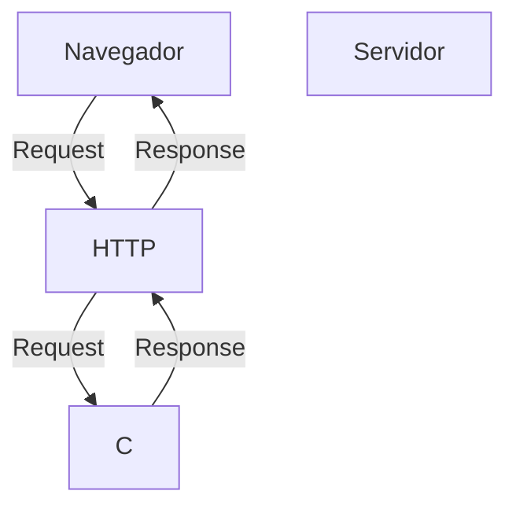
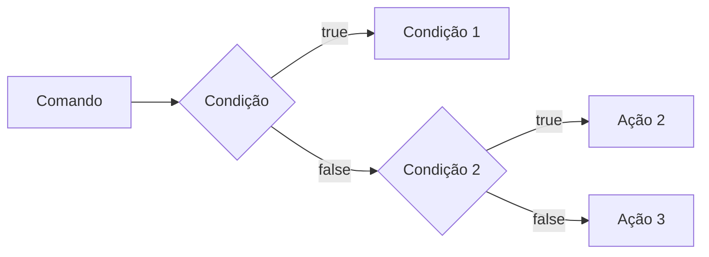
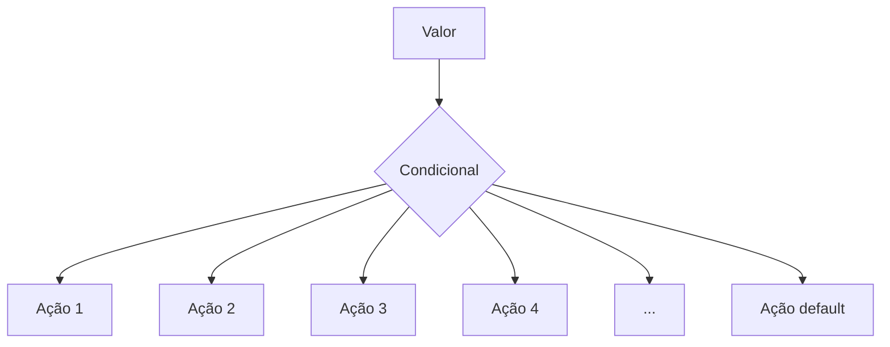
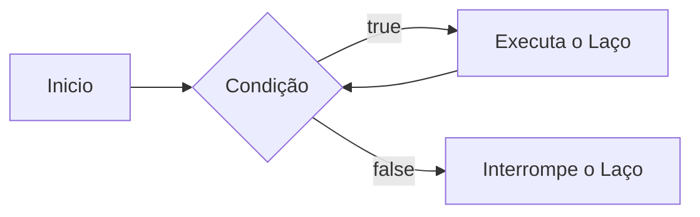

# Curso BackEnd - 1 Semestre - 105h

Prof. Diogo Barbosa

escola SENAI Americana

2 Semestre de 2026

## Objetivo do curso

- Desenvolver Aplicações Web server Side, utilizando a linguagem PHP;
- Aplicar sintaxe nativa php Vanilla;
- Manipulação HTTP;
- Percistencia de dados (Armazenamento em BD);
- Segurança contra SQL Injection/csrf;
- Refatoração em POO (programação orientada objeto);
- Arquitetura MVC;
- Utilização do FrameWork Laravel

## Cronograma do semestre

Carga horária: 105h

Duração: 20 semanas

### Semana 1: Introdução ao BackEnd e configuração do ambiente PHP

#### O que é BackEnd?
O BackEnd é a parte de um site ou aplicativo que o usuario não ve, mas que faz tudo funcionar por trás das telas.

As principais linguagens utilizandas no desenvolvimento Back-End são PHP, JavaScript/typeScript, Python, Java, Kotlin, Go (Golang), C# e Rust.

- Guarda e organiza informações em um banco de dados;
- confere se o login e a senha estão corretos;
- Calcula valores, como o frete ou o total de uma compra;
- Garante que os dados de um usuario não apareçam para o outro;
- faz o sistema suportar muitas pessoas usando ao mesmo empo, sem travar

O Back-End é o "Cérebro"oculto de um site ou aplicativo.ele roda em um servidor e cuida de tudo o que o usuario não ve na tela.

## As 3 partes básicas de todo BackEnd:
1. **Servidor**
O "computador" que fica ligado esperando pedidos  (requisições);
2. **Banco de dados:**  onde as informações ficam guardadas (usuários, produtos, mensagens, etc.);
3. **Lógica de negócio:**  as regras do sistema (ex: "não deixa comprar se não tiver estoque").

**O Mercado de Trabalho em Back-end**

O desenvolvimento Back-end é uma das áreas mais cruciais da Tecnologia da Informação. 

- Com a transformação digital acelerada, empresas de todos os portes e setores dependem de infraestruturas sólidas e seguras. 

- Setores de Atuação: Bancos, hospitais, e-commerces, logística, indústrias, startups e órgãos públicos utilizam Back-end para suportar suas operações críticas.

- Fatores de Crescimento: O avanço da computação em nuvem, aplicativos móveis, Big Data e IA impulsiona continuamente a busca por profissionais da área.

- Modelos de Trabalho: Alta flexibilidade com vagas presenciais, híbridas e remotas (inclusive com oportunidades internacionais).


#### Ciclo de vida da requisição HTTP

##### Oque é HTTP?

HTTP, Hypertext Tranfer Protocolo, é um protocolo de comunicação utilizado para tranferencia de informações na  www(Word Wide Web) e em outros sistemas de redes

O HTTP é a base para que o cliente e um servidor web troquem informações. ele permite a requisição e a resposta de recursos, como imagens, arquivos e as proprias paginas web, por meio de mensagens (protocolos);

##### Como Funciona o HTTP?

1. O cliente estabele contato com o servidor, encamihando uma requisição HTTP;
2. Nessa Requisição o cliente especifica o método pretendido (read-GET, create-POST, update-PUT/PATCH, delete-DELETE)
3.  O servidor processa ou responde com uma mensagem HTTP, com os recursos solicitados .´


#### Como funciona na pratica o BackEnd

- **Ação do usuario:** Envia uma solicitação pera UI (Interface do Usuario). Exemplo de UI: Tela do celular, Navegador da Internet, Alexa...
- **Envio da requisição:** a UI transforma ação do usuario em requisição HTTP
- **O processamento BackEnd:** o codigo backEnd recebe o pedido, valida os dados e decide o que fazer (ex: consulta uma informação no banco de dados)
- **Resposta:** O servidor devolve o resultado para a UI (Ex: um login autorizado, uma compra confirmada, )

#### Tipos de Requisição HTTP
 os tipos de requisição HTTP indicam a ação que o usuario deseja executar no servidor. as principais ações são:

 - **GET:** pede dados de um lugar especifico. "Não faz alterações no servidor"
 - **POST:** Envia dados novos para *criar* algo ou processar informações.
 - **PUT/PATCH:** Modificar dados já existentes. *PUT* Atualização geral dos dados. *PATCH* Atualização parcial dos dados.
 - **DELETE:** Apaga um dado do servidor.

#### Iniciando o PHP


##### O que é PHP?

**PHP** (Hypertext PreProcessor) é uma linguagem de programação interpretada e open source, focada no desenvolvimento de sistemas para web, pode ser usada junto com HTML para criação de paginas web dinamicas

##### Instalando o PHP
- fazer o Dowload do PHP (php.net);
- ZIP - non theread safe 8.5
- Descompactar o arquivo do php na pasta C:\src\php (para Descompacatar, usar o 7Zip = Melhor) => nunca salvar um arquivo na raiz do sistema(c:)
- Modificar o arquivo php.ini-development para => php.ini (Criar as configurações do PHP na Maquina) - adicional ou remover funcionalidade do PHP
- Adicionar a pasta do PHP(c:\src\php) as variaveis de ambiente do sistema (PATCH)
- verificar a instalação rodando o comando php --version

##### Contextualizando o PHP
O PHP de fato é uma das linguagens de programação mais populares da atualização. Ela permite que voce crie aplicações web robustas, de uma maneira muito simplificada e direto ao ponto.
sem contar que a linguagem traz diversos recursos que faciitam e aceleram o processo de desenvolvimento de sites e sistemas para a web. E além do mais, ela ainda tem um otimo ecossistema, uma exelente comunidade e um grande mercado de trbalho.

##### Criando minha primeira aplicação em PHP
Criando um Hello, Word!

##### Criando o perfil de PHPVanilla

-> Profile -> New Profile
-> Extensions:
- PHP InterPhense ( a do elefantinho): AutoCompletar (Snipets)
- PHP Debug (Xdebug): Acha erros
- PHP CS FIXER : Formatação padrão do codigo(identação)
- PHP Server: Sobre um servidor local para acompanhamento em tempo real.


##### Estudo de Variaveis e constantes em PHP

Declarar Váriaveis é alocar um espaço na memoria que permite a inclusão e manipulação de dados.

**Variáveis**

- devem ser declaradas  usando "$" antes do none da variável
- podem ser string, numérica (integer e flost), booleanas e nulas. não permite declaração de Undefined
- são não tipadas (não precisa declarar o tipo na criação),  a tipagem é atribuida ao adicionar o valor
- usar o "declare(strict_types=1);" n aprimeira linha do arquivo ; => blindar o sistema contra conflitos de tipos de variaveis

**Constantes**

- não podem ser modificadas ou redeclaradas após a criação
- pode ser criada usando "const" ou "define"
- não permitem interpolção


### Semana 2 - Operadores em PHP ( aritméticos, Relacionais e Lógicos)

##### Estudo de Operadores

**Aritméticos**: são usados para realizar cáuculos

| Operador | Nome | Exemplo | Resultado |
| - | - | - | - |
| + | Adição | 10 + 5 | 15 |
| - | Subtração | 10 - 5 | 5 |
| * | Mutiplicação | 10 * 5 | 50 |
| / | Divisão | 10 / 5 | 2 |
| % | Módulo (Resto) | 10 % 3 | 1 (10 div 3 da 3, sobre 1) |
| ** | Expoente | 2 ** 3 | 8(2 elevado a 3) |

Obs: O Operador % é o melhor amigo de um programação, permite ordenar listas e organizar fila e pilhas.

**Relacionais** : Permitem uma comparação entre dois ou mais valores,  o resultado de uma operação relacional é sempre uma booleana (true, false)

| Nomes | Operador | Exemplo | Resultado |
| - | - | - | - |
| Iguais | == | "10"==10 | true |
| Igualdade estrita | === | "10"===10 | false |
| Diferente | != | "10"!=10 | false|
| Diferença estrita | !== | "10"!==10 | true |
| Maior que | > | 18 > 18 | false |
| Menor que | < | 10 < 20 | true |
| Maior ou igual | >= | 18 >= 18 | true|
| Menor ou igual | <= | 10 <= 5 | false |

**Lógicos**: Permite a combinação entre sentenças.

- Operador AND (E) => && : para o resultado se verdadeiro, TODAS as combinações precisam ser verdadeiras
  - true && true => true
  - true && false => false
- Operador OR (OU) => || : para o resultado sera verdadeiro, basta APENAS UMA condição ser verdadeira
  - false || true => true
  - false || false => false

- Operador NOT (não) => ! : Inverte a lógica da sentença
  - !true => false
  - !false => true

  ### Semana 3 - Estrutura de controle de Dados (Condicionais e Repetição)

**Conteúdo**: Estrutura `if`, `else`, `elseif`, Operadores Ternários, `match` => 
 substituto do `swicth/case`, loops `for`, `while`, `do-while` e `foreach`

 #### Estrutura de Controle de dados ajudam no processo de automatização em programas e sistemas

 ##### Condicionais (IF, ELSE, ELSEIF)

 - **Forma de Uso**

 - Uso do `if` apenas:
 Exemplo: Aplicar um desconto de 10% em compras acima de 100 Reais

 ```mermaid

 graph LR
     A[Comando] --> B[Condição] --> C[Tomada de Decisão]

 ````

 ```php
 if ($valorCompra > 100) {
  $valorCompra = $valorCompra * 0.1
 }
 ```

 - Uso do `if` seguido do `else`
 Exemplo: Aplicar um desconto de 10% para compras acima de 100 reais e 5% para as demais compras

 ```mermaid

 graph LR

     A[Comando] --> B{Condição}
     B --> |true| C[Ação 1]
     B --> |false| D[Ação 2]

 ```

```php

if($valorCompra > 100) {
  $valorFinal = $valorCompra*0.1;
} else{
  $valorFinal = $valorCompra*0.05;
}

```

- Uso do `elseif` (Encadeado)
Exemplo: Compras acima de 200 reais tem 15% de desconto, acima de 100 reais tem 10% de desconto e outras 5% de desconto



```php

if($valorCompra > 200){
  $valorFinal = $valorCompra*0.85;
} elseif($valorCompra >100) {
  $valorFinal - $valorCompra*0.9;
} else {
  $valorFinal = $valorCompra*0.95;
}

```

*OBS*: Sempre Usar `elseif` para situações que precisam de mais de uma condição, ou seja, fazer encadeamento das condições.

*OBS* Uso **errado** do `if` que é não fazer o encadeamento de condicionais

Exemplo:

```php
if($valorCompra > 200) {
    $valorFinal = $valorCompra*0.85;
}
if($valorCompra > 100) {
    $valorFinal = $valorCompra*0.90;
}
if($valorCompra < 100) {
  $valorFinal = $valorCompra*0.95;
}

```

##### Operadores Ternários

um atalho para a estrutura condicional `if/else`, normalmente escrito em uma unica linha de código

` condição ? verdadeira : falso `

perfeito para decições curtas de uma linha de comando
Exemplo: Verificar se a pessoa é maior de idade (18)

```php

$idade = 20;
//O formato é : (condição) ? verdadeiro : falso;

$status = ($idade >= 18) ? "Maior de idade" : "Menor de idade";
$status2 = ($idade<18) ? "Criança" : ($idade<60) ? "adulto" : "idoso";
```

##### Expressão Condicional `match` (php 8)

No mercado de PHP atual, não se usa mais uma dezena de `if/elseif` para checar valores fixos, e o antigo `switch/case` caiu em desuso. Usamos o `macth`. Ele compara um valor e retorna diretamente o resultado




```php

$diaSemana = date("Week"); // Pega o dia da semana em formato numérico

//Tranforma dia da semana em formato texto (Domingo, Segunda,...)

$nomeDiaSemana = match($diaSemana){
  "0" => "Domingo",
  "1" => "Segunda",
  "2" => "Terça",
  "3" => "Quarta",
  "4" => "Quinta",
  "5" => "Sexta",
  "6" => "Sabado",
  "default" => "Dia Invalido"
};

```

##### Laços de Repetição

Um laço de repetição faz com que, um bloco de códigos rode várias vezes, até que uma condição mande parar.

- O Laço `while` (enquanto)

Ele verifica se a condição é vrdadeira ANTES de entrar no laço. Ideal quando voce não sabe quantas vezes vai rodar o laço.



Exemplo: Jogo de adivinhação de um número Secreto

```php

$numeroSecreto = 7;

$tentativas = 0;

while($tentativa != $numeroSecreto){
   echo "Tente Novamente"
  //vou pegar um número aleatório entre 1 e 10
  $tentativa = rand(1,10);
}

echo "Acertou !!! o número secreto é $numeroSecreto";

```

- O Laço `do-while` (Faça-enquanto)
A diferença é que ele executa o bloco pelo menos uma vez, mesmo que a condição seja falsa desde o inicio, pois ele só pergunta no final


Exemplo: Jogo de adivinhação

```php

$numeroSecreto = rand(1,10);

do {
    $tentativa = rand(1,10); Simular um palpite aleatório
    
    if($tentativa == $numeroSecreto){
      echo "parabéns, Acertou!!!!!"
    }
} while ($tentativa != $numeroSecreto);

```

OBS: Uso ideal do `do-while`, menus de sistema ou sistemas de solicitações de dados, sistemas interativos;
